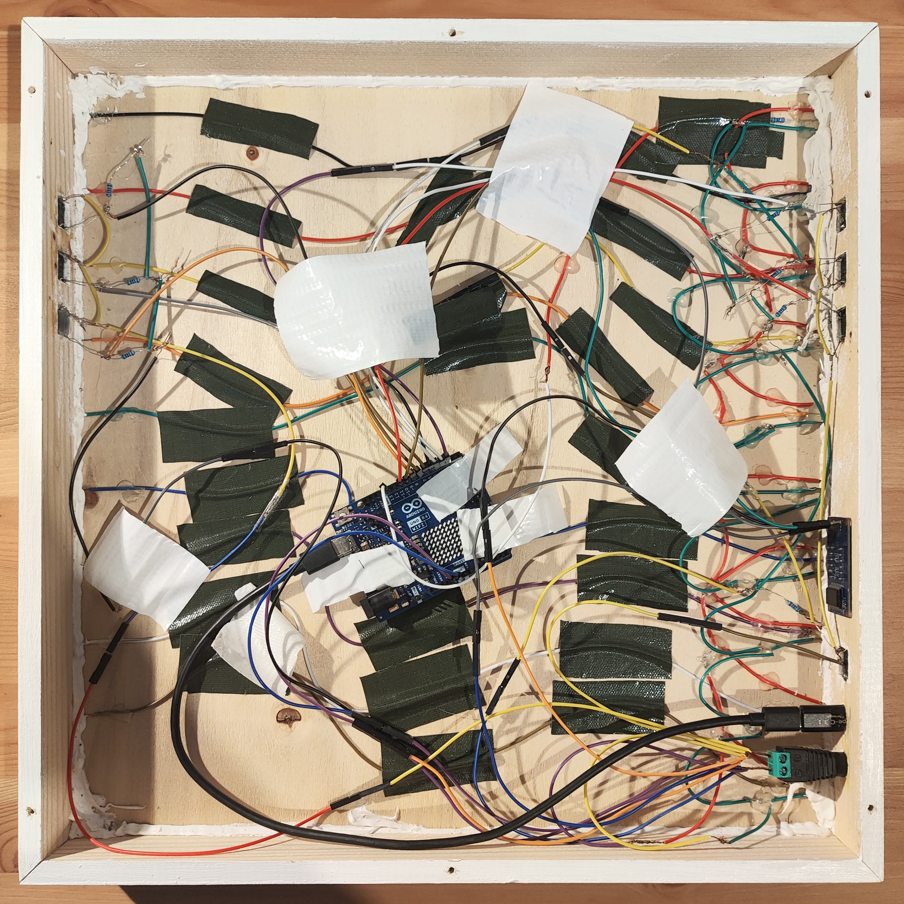
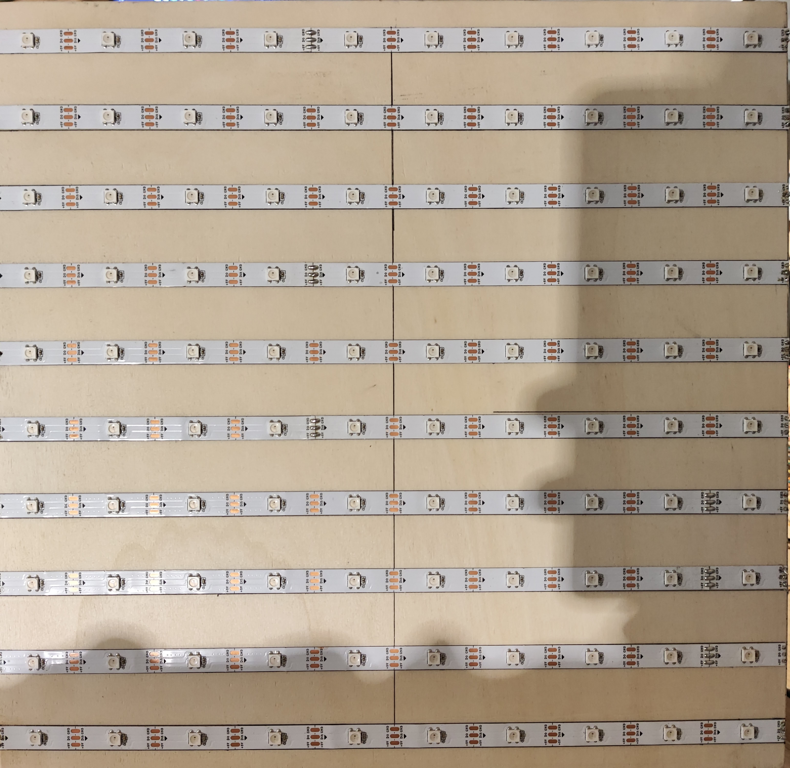
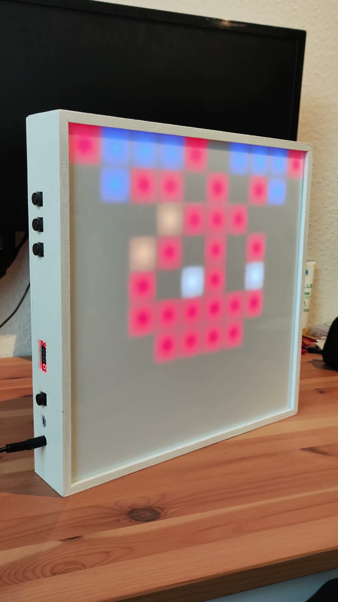
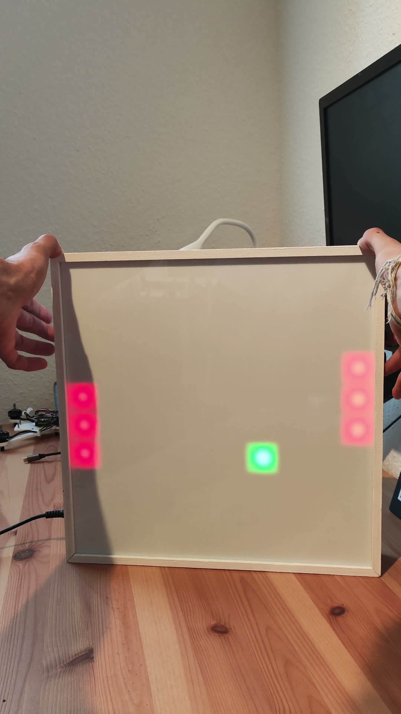

# Animated 10x10 RGB LED pixel matrix

*Legacy Arduino/Java project made a couple years ago preserved mainly for portfolio purposes and with no intention of refactoring.*

This project contains a handmade 10x10 RGB LED pixel matrix that displays pixel animations and features a built-in Ping Pong mode. A separate desktop tool is provided for creating custom pixelart frames.

## Gallery
<table>
    <tr>
        <th>Front</th>
        <th>Left side</th>
        <th>Right side</th>
    </tr>
    <tr>
        <td align="center" width="33%">
            
        </td>
        <td align="center" width="33%">
            
        </td>
        <td align="center" width="33%">
            
        </td>
    </tr>
</table>

<table>
    <tr>
        <th>Inside</th>
        <th>LEDs mounted</th>
    </tr>
    <tr>
        <td align="center" width="50%">
            
        </td>
        <td align="center" width="50%">
            
        </td>
    </tr>
</table>

## Demo
<table>
    <tr>
        <td align="center" width="50%">
            <a href="./assets/videos/led_matrix_animation.mp4">
                
            </a>
            <br>
            <a href="./assets/videos/led_matrix_animation.mp4">Download video</a>
        </td>
        <td align="center" width="50%">
            <a href="./assets/videos/led_matrix_ping_pong.mp4">
                
            </a>
            <br>
            <a href="./assets/videos/led_matrix_ping_pong.mp4">Download video</a>
        </td>
    </tr>
</table>

## Features

- 10x10 RGB LED matrix with `100` `WS2812B` LEDs
- frame-based pixel animations
- built-in Ping Pong mode
- adjustable LED brightness
- adjustable `TM1637` display brightness
- custom Java desktop tool for creating and exporting pixelart frames

## Hardware

Main components:

- Arduino UNO R4 WiFi
- `100` `WS2812B` LEDs arranged as a 10x10 matrix (`BTF-Lighting WS2812B LED Strip`, `5m`, `30 LEDs/m`)
- `TM1637` 4-digit display
- 7 push buttons
- custom wooden housing with an opal white acrylic glass front, measurements:
    - outer dimensions: `35.5x35.5cm`
    - wall thickness: `9mm`
    - thickness of the glass front: `3mm` (`2mm` also works)
    - backplate and LED mounting plate thickness: `3mm`

Additional materials:

- `40W` power supply with `5V`, `8A`, and a `5.5x2.5mm` barrel plug
- `5.5x2.5mm` barrel jack to screw terminal
- USB-C to USB-C cable
- USB-C to USB-C adapter
- soldering equipment
- jumper wires
- wood glue
- white paint
- screws for mounting the backplate

Pin mapping used in the sketch:

- LED data pin: `13`
- display `CLK`: `10`
- display `DIO`: `9`
- buttons: `2` to `8`

Power consumption:

- The `100` `WS2812B` LEDs have a theoretical maximum power draw of about `30W`.
- This is based on roughly `60mA` per LED at `5V` at full white brightness.
- Maximum current draw: about `6A` at `5V`.

## Firmware

The Arduino sketch is located in [`arduino/LEDMatrix/LEDMatrix.ino`](./arduino/LEDMatrix/LEDMatrix.ino). It uses the `FastLED` and `TM1637Display` libraries.

It contains:

- 11 animation functions named `a1()` to `a11()`
- 2 modes controlled by the `mode` variable
- debounced button handling
- score output on the 4-digit display
- movement and collision logic for Ping Pong

Mode mapping:

- `mode == 1`: animation mode
- `mode == 2`: Ping Pong mode

## Controls

In animation mode:

- `Button 1`: next animation or increase selected value
- `Button 2`: previous animation or decrease selected value
- `Button 3`: switch between animation mode and Ping Pong mode
- `Button 4`: cycle through animation selection, LED brightness and display brightness

In Ping Pong mode:

- `Button 1`: move left paddle up
- `Button 2`: move left paddle down
- `Button 4`: reset the game and score
- `Button 5`: move right paddle up
- `Button 6`: move right paddle down
- `Button 7`: start, pause or resume the game

## PixelArtMaker

[`java/PixelArtMaker/`](./java/PixelArtMaker/) contains a Java Swing desktop tool for creating frames for the LED matrix.

It provides:

- a 10x10 editing grid
- RGB sliders
- preset colors
- save and restore functions
- tree-based frame organization
- export of `led[index].setRGB(r, g, b);` output for the Arduino code

Controls:

- `clear all`: clears the complete 10x10 grid
- `save`: saves the current frame to the selected node
- `restore`: restores the selected frame
- `new`: creates a new node in the tree
- `delete`: deletes the selected node
- `output`: generates `led[index].setRGB(r, g, b);` output for the Arduino sketch

Grid interaction:

- left click: paint a pixel with the selected color
- middle click: pick the color of a pixel
- right click: clear a pixel

Color controls:

- RGB sliders for custom colors
- preset color buttons for quick selection

Technical details:

- Maven project
- Java version `21`
- main class: `com.github.rossiesh.PixelArtMaker`
- frame files stored in [`java/PixelArtMaker/Pixelart`](./java/PixelArtMaker/Pixelart)
- tree state stored in [`java/PixelArtMaker/tree`](./java/PixelArtMaker/tree)

## How it works

Animations are displayed by the Arduino sketch on the LED matrix. The desktop tool is used to draw frames on a `10x10` grid and store them as files. These frames can then be exported as `FastLED` statements and copied into the animation functions in the Arduino sketch.

The Ping Pong mode is implemented directly in the sketch. It uses button input for both paddles, shows the score on the display, and increases the game speed over time by reducing the movement interval of the ball.

## Project structure

```text
led_matrix/
|-- arduino/
|   `-- LEDMatrix/
|       `-- LEDMatrix.ino
|-- java/
|   `-- PixelArtMaker/
|       |-- pom.xml
|       |-- src/main/java/com/github/rossiesh/
|       `-- Pixelart/
`-- assets/
```
